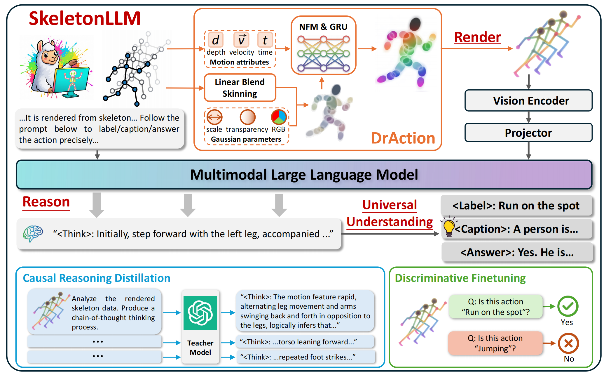
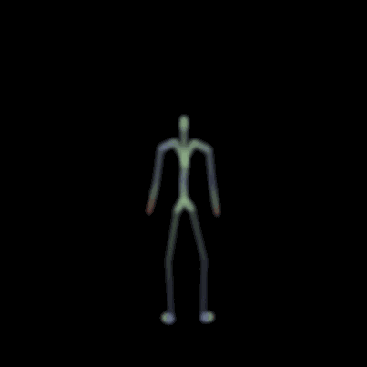
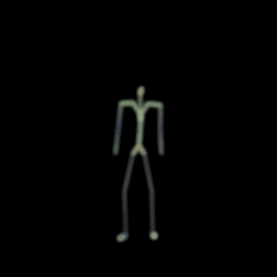
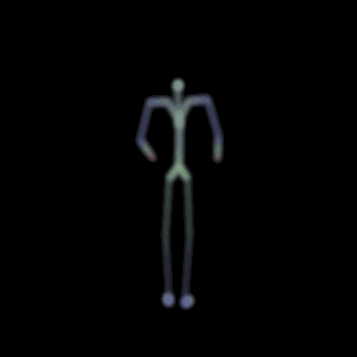
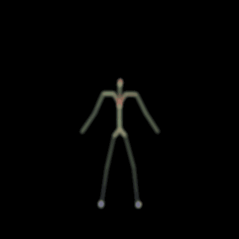
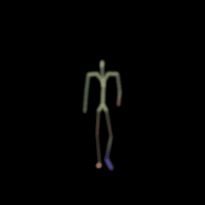
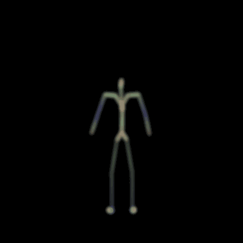

# SkeletonLLM

Official repository for the ICML 2026 paper: 

**Universal Skeleton Understanding via Differentiable Rendering and MLLMs**

[[Paper]](https://arxiv.org/abs/2603.18003)
[[Visualization Gallery]](https://wangzy01.github.io/SkeletonLLM/)

## Overview

SkeletonLLM translates heterogeneous human skeleton sequences into the native visual modality of multimodal large language models. Its core module, DrAction, is a differentiable, format-agnostic renderer that converts skeletal kinematics into compact RGB sequences and can be optimized end-to-end by gradients from the MLLM.

The framework supports universal skeleton understanding across recognition, captioning, question answering, and cross-format transfer, while avoiding skeleton-topology-specific encoders or discrete motion tokenizers. It follows a Render → Reason → Respond pipeline: DrAction renders a skeleton sequence into motion-aware pseudo-images, the MLLM's vision encoder + projector turn them into visual tokens, and the language model reasons over them.



## Visualizations

DrAction-rendered skeleton sequences:

| Left leg kick | Lifting and placing | Handstand |
| --- | --- | --- |
|  |  |  |

| Punching sequence | Walking in place | Waving both hands |
| --- | --- | --- |
|  |  |  |

## Setup

The model is built on InternVL3-8B (OpenGVLab, original `InternVLChatModel` format). Download it and point `MODEL` at the local path. The LLM is Qwen2-based, which is what the LoRA target modules are configured for.

## Data Preparation

The training pipeline consumes JSONL annotations with the standard InternVL conversation format; a single skeleton file is rendered on the fly into 12 frames (one per `<image>` placeholder):

```json
{"id": "S001C001P001R001A001", "image": "S001C001P001R001A001.skeleton",
 "conversations": [{"from": "human", "value": "...<image>..."},
                   {"from": "gpt", "value": "drink water"}]}
```

### NTU-60 skeletons

Place the raw NTU `.skeleton` files under one directory (`DATA_ROOT`). Supported zero-shot splits (the number is the count of *seen* training classes; the rest are held out): `ntu60_55_cs`, `ntu60_48_cs`, `ntu60_40_cs`, `ntu60_30_cs`, plus `ntu60_all_cs` for a closed-set sanity check.

### MQA annotation (Stages 1 & 4)

```bash
python tools/build_ntu_annotation.py \
  --skeleton-root /path/to/ntu/raw \
  --output data/ann/ntu60_48_cs_mqa.jsonl \
  --split ntu60_48_cs
```

### Disc-FT annotation (Stage 2, optional)

Binary YES/NO judgments over hard negatives. The top-5 semantically similar actions per class (`data/ntu60_similar_actions.json`, mined with a strong MLLM and shipped here) are intersected with the split's seen classes, yielding a ~1:1 YES:NO balance:

```bash
python tools/build_discft_annotation.py \
  --skeleton-root /path/to/ntu/raw \
  --output data/ann/ntu60_48_cs_discft.jsonl \
  --split ntu60_48_cs
```

### CR-Distill annotation (Stage 3, optional)

CR-Distill distills causal reasoning from a teacher model; GPT-4o is used as an example, but you can choose any teacher model you prefer, such as GPT-5.5 or Qwen3.5-VL.

```bash
# 1) render training clips with the Stage-2 DrAction weights (exported via
#    tools/export_draction_weights.py) into per-clip frame folders:
python visualize/draction_visualize.py --dataset ntu --enable-nfm \
  --input /path/to/ntu/raw --weights /path/to/stage2_draction.safetensors \
  --output-dir data/cr_frames --max-samples 0

# 2) query the teacher (needs `pip install openai` and an API key):
OPENAI_API_KEY=sk-... python tools/generate_teacher_rationales.py \
  --frames-root data/cr_frames --output data/ann/teacher_rationales.jsonl \
  --split ntu60_48_cs --model gpt-4o

# 3) build the student annotation (student prompt has no ground-truth label;
#    target is the full teacher rationale incl. the final "Label:" line):
python tools/build_crdistill_annotation.py \
  --rationales data/ann/teacher_rationales.jsonl \
  --skeleton-root /path/to/ntu/raw \
  --output data/ann/ntu60_48_cs_crdistill.jsonl
```

## Training

Four progressive stages address the renderer↔MLLM "chicken-and-egg" problem. **Stages 1 and 4 are required; Stages 2 and 3 are optional** enhancements. Default epochs are 1 / 1 / 1 / 3. The LLM and vision backbone are always frozen.

| Stage | Script | Trains | Task | Required |
| --- | --- | --- | --- | --- |
| 1 Render Warm-up | `shell/stage1_render_warmup.sh` | DrAction + projector | MQA | **yes** |
| 2 Disc-FT | `shell/stage2_disc_ft.sh` | DrAction + projector | binary YES/NO | optional |
| 3 CR-Distill | `shell/stage3_cr_distill.sh` | DrAction + projector + LLM LoRA | teacher rationale | optional |
| 4 Recognition Refine | `shell/stage4_recognition.sh` | projector + LLM LoRA (**DrAction frozen**) | MQA | **yes** |

**Minimal pipeline (Stages 1 → 4):**

```bash
# Stage 1: warm up DrAction + projector (start from base InternVL3-8B)
MODEL=/path/to/InternVL3-8B \
DATA_ROOT=/path/to/ntu/raw \
ANNOTATION_FILE=data/ann/ntu60_48_cs_mqa.jsonl \
OUTPUT_DIR=work_dirs/ntu60_48_cs/stage1 \
bash shell/stage1_render_warmup.sh

# Stage 4: freeze DrAction, train projector + LLM LoRA on MQA (3 epochs)
MODEL=work_dirs/ntu60_48_cs/stage1 \
DATA_ROOT=/path/to/ntu/raw \
ANNOTATION_FILE=data/ann/ntu60_48_cs_mqa.jsonl \
OUTPUT_DIR=work_dirs/ntu60_48_cs/stage4 \
bash shell/stage4_recognition.sh

# merge the Stage-4 LoRA into a standalone checkpoint for inference
python tools/merge_lora.py work_dirs/ntu60_48_cs/stage4 work_dirs/ntu60_48_cs/stage4_merged
```

**Full pipeline (1 → 2 → 3 → 4).** Stages 1 and 2 save plain checkpoints. Stages 3 and 4 use LoRA, so **merge before using their output as the next `MODEL`**:

```bash
# Stage 2 (from Stage 1 checkpoint), Disc-FT annotation
MODEL=work_dirs/.../stage1 ANNOTATION_FILE=..._discft.jsonl OUTPUT_DIR=.../stage2 \
  DATA_ROOT=/path/to/ntu/raw bash shell/stage2_disc_ft.sh

# Stage 3 (from Stage 2), CR-Distill annotation -> then MERGE (LoRA)
MODEL=work_dirs/.../stage2 ANNOTATION_FILE=..._crdistill.jsonl OUTPUT_DIR=.../stage3 \
  DATA_ROOT=/path/to/ntu/raw bash shell/stage3_cr_distill.sh
python tools/merge_lora.py work_dirs/.../stage3 work_dirs/.../stage3_merged

# Stage 4 (from merged Stage 3), MQA annotation -> then MERGE for inference
MODEL=work_dirs/.../stage3_merged ANNOTATION_FILE=..._mqa.jsonl OUTPUT_DIR=.../stage4 \
  DATA_ROOT=/path/to/ntu/raw bash shell/stage4_recognition.sh
python tools/merge_lora.py work_dirs/.../stage4 work_dirs/.../stage4_merged
```

Renderer training is memory-heavy at 448×448 (the per-Gaussian rasterizer); gradient checkpointing is on by default and the reference runs used 2×H20 GPUs.

## Evaluation

```bash
python eval/test_ntu.py \
  --model-path work_dirs/ntu60_48_cs/stage4_merged \
  --skeleton-root /path/to/ntu/raw \
  --output-file outputs/ntu60_48_cs.tsv \
  --split ntu60_48_cs --render-frames 12 --render-size 448 --enable-nfm

python eval/calculate_ntu_accuracy.py outputs/ntu60_48_cs.tsv --split ntu60_48_cs
```

## Visualization

The standalone visualizer renders 12 frames at 448×448 and writes per-frame PNGs, an `animation.gif`, and a `render.json` record. It reads `num_line_samples` from the weight metadata by default (10 for the released candidates).

```bash
# NTU (exact topology of the released weights)
python visualize/draction_visualize.py --dataset ntu --enable-nfm \
  --input /path/to/ntu/raw --sample-ids S001C001P003R001A004 --max-samples 1 \
  --weights draction_weights/candidates/draction_candidate_01.safetensors \
  --output-dir outputs/viz_ntu

# HumanML3D (22-joint SMPL; cross-topology transfer of the shared appearance/NFM)
python visualize/draction_visualize.py --dataset humanml3d --enable-nfm \
  --input /path/to/humanml3d/converted --sample-ids 000074 --max-samples 1 \
  --weights draction_weights/candidates/draction_candidate_01.safetensors \
  --output-dir outputs/viz_humanml3d
```

## Pretrained DrAction Weights

`draction_weights/candidates/` ships three standalone renderer-only DrAction checkpoints: Candidate 1, Candidate 2, and Candidate 3.

## Notes

- DrAction is trained only on NTU (Kinect v2, 25 joints). The shipped weights render NTU via the exact-topology path (uniform Gaussian scales). Other formats such as HumanML3D are rendered by cross-topology transfer — the trained appearance is shared, line points are sampled proportionally to bone length, and a uniform Gaussian radius is used (`--scale-gamma 0`) so limbs stay thin and equally thick.
- **MQA** uses the label-only prompt by default; `prompts.py` also exposes a reasoning-style variant via `simplified=False`.

## Citation

```bibtex
@article{wang2026universal,
  title={Universal Skeleton Understanding via Differentiable Rendering and MLLMs},
  author={Wang, Ziyi and Li, Peiming and Wang, Xinshun and Tang, Yang and Ma, Kai-Kuang and Liu, Mengyuan},
  journal={arXiv preprint arXiv:2603.18003},
  year={2026}
}
```
